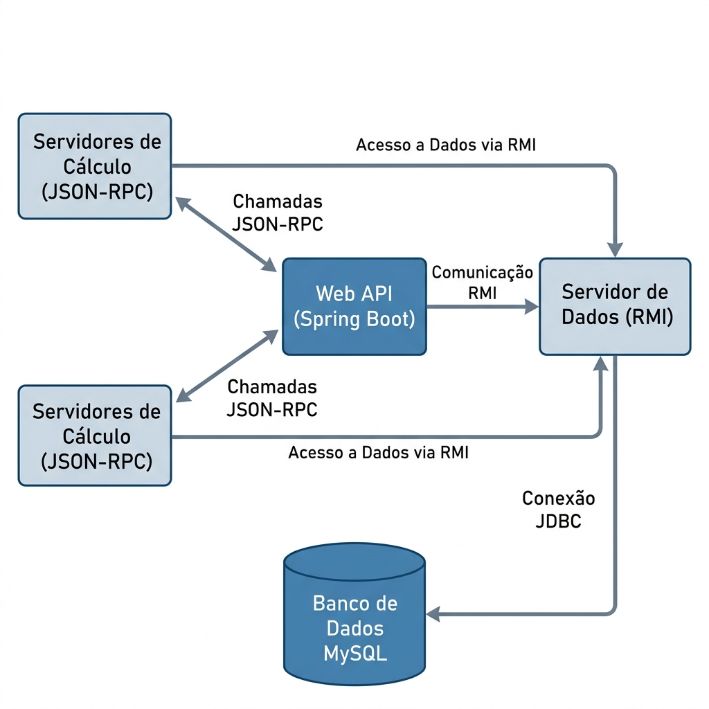

# Projeto DHRMS - Respostas da Avaliação (Atividade 5)

Este arquivo contém as respostas para as questões propostas na Atividade 5.

### 1. Qual tecnologia de comunicação o servidor de cálculo utiliza?
O servidor de cálculo utiliza a tecnologia de **Sockets TCP** para a comunicação de rede, permitindo uma conexão bidirecional e confiável entre a Web API e os servidores de cálculo.

### 2. Qual protocolo de mensagem o servidor de cálculo utiliza?
O protocolo de mensagem utilizado é o **JSON-RPC (versão 2.0)**. Os dados são estruturados em objetos JSON seguindo o padrão RPC.

### 3. Qual tecnologia de comunicação o servidor de cálculo utiliza?
Como mencionado anteriormente, o servidor de cálculo utiliza **Sockets TCP** (Sockets de Fluxo) para o transporte de dados através da rede.

### 4. Qual estilo arquitetural o projeto web api implementou para expor suas funcionalidades?
O projeto Web API implementou o estilo arquitetural **REST (Representational State Transfer)**, utilizando endpoints HTTP (GET/POST) para expor os serviços de RH de forma padronizada.

